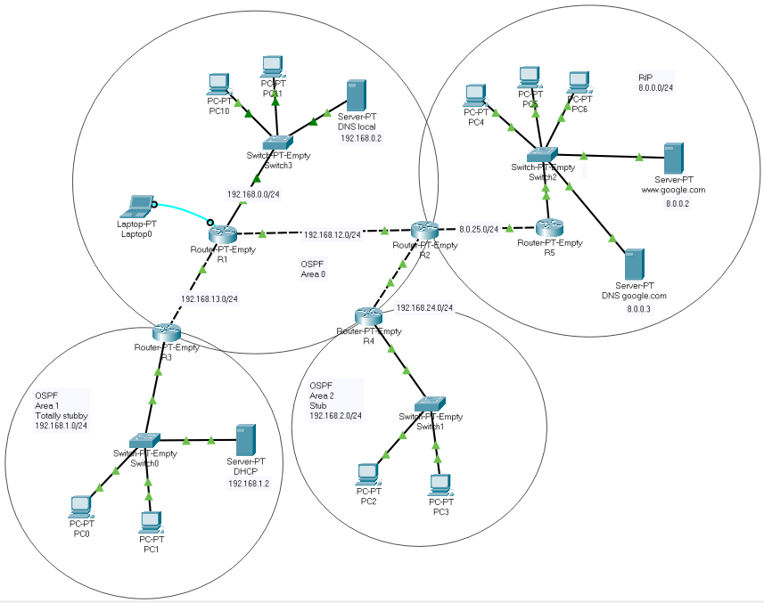

# computer-networks
[Computer Networks] Multi-domain network topology simulation and configuration using Cisco Packet Tracer.

Homework/project in **Computer Networks 1 (13E112RM1)** at the University of Belgrade, School of Electrical Engineering.

## Network topology

### RIP (Routing Information Protocol) segment
* RIPv2 routing protocol configured on routers R2 and R5.
* DHCP (Dynamic Host Configuration Protocol) configured on router R5.
* Access list (ACL) configured on router R5.

### OSPF (Open Shortest Path First) segment
* OSPF routing protocol configured on routers R1-R4.
* OSPF domain consists of 3 areas: Area 0 (Backbone), Area 1 (Totally stubby), Area 2 (Stub).
* DHCP server configured in OSPF Area 1.
* DNS (Domain Name System) server configured in Area 0.

### Extras
* Two-way route redistribution configured on router R2 (SBR).
* Password-protected TELNET configured on router R1.
